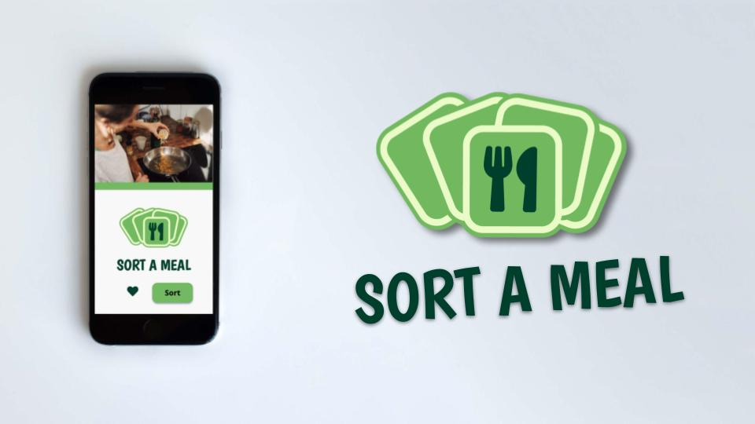
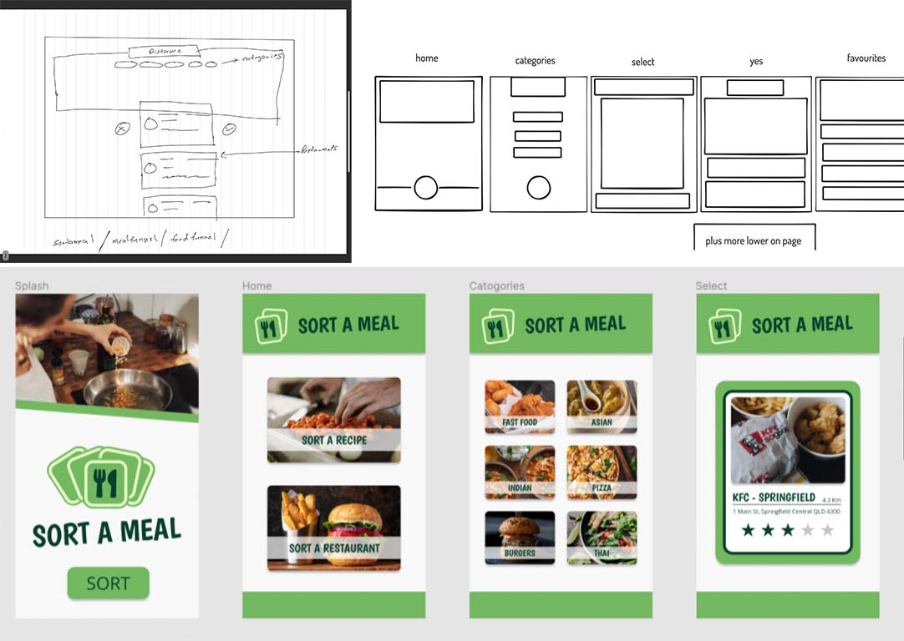
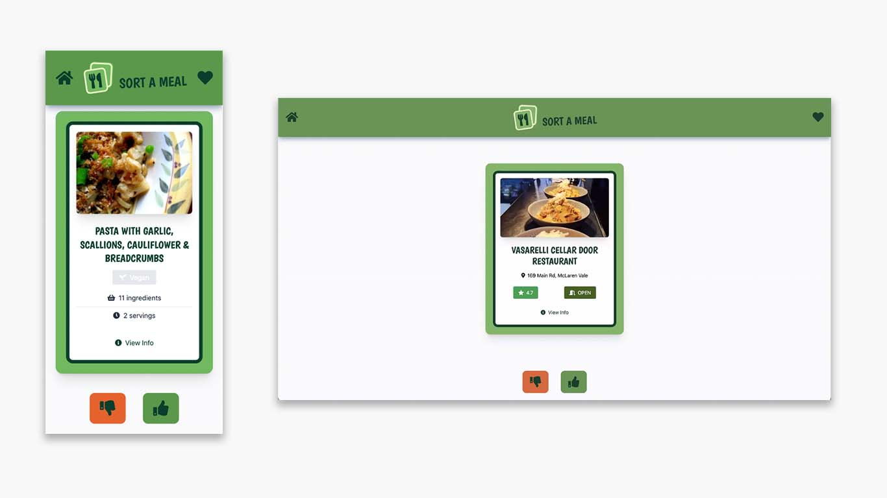

# SORT A MEAL - Group Project



## Team members

- [Hari](https://github.com/hari-ls)
- [Alex](https://github.com/mckayjalex)
- [Clayton](https://github.com/ClaytonMcIntosh/)
- [Jaiden](https://github.com/JaidenSP) (concept and planning)

## Description

Sort a meal's concept came together by merging a few ideas. First, we needed to use two APIs for the project which were free to access. This provided us with a few ideas including access to locations and restaurant data through Google APIs. Another part of the idea came from some baby name apps that use a 'Tinder-like' swipe function to sort through potential baby names. This got us discussing how hard it is to decide when ordering meal on apps such as Uber Eats, which lead us to the final idea of Sort a Meal

### Elevator pitch

> Sort a Meal helps solve the problem of being indecisive at meal time. The app gathers local restaurants or recipes and helps you sort through meal options so you can find a meal you want.

### User story

```
AS AN indecisive eater
I WANT an app that cycles through restaurants and recipes
SO THAT I can find something appetizing to eat
```

### Acceptance criteria

```
GIVEN I am indecisive at meal times
WHEN I use the app
THEN I am presented with an options to sort between a recipe or a restaurant
WHEN I make my choice
THEN I am presented with different categories of food
WHEN I make my choice
THEN I am presented a deck of cards with recipes or local restaurants to sort
WHEN I read the cards
THEN I am presented with useful information
WHEN I click thumbs up
THEN the card is saved to my favourites
WHEN I access my favourites cards
THEN I am presented with previous cards I have created
```

## Development

The project took just under two weeks from finding out our team to final presentation.

After working on the concept, we started on researching APIS, CSS frameworks, and similar ideas. We started a [FigJam](https://www.figma.com/) project to keep out ideas together and used a kanban project system on [GitHub](https://github.com/). We also developed a wireframe, fleshing it out into a simple prototype in [Figma](https://www.figma.com/).



Next came starting on the application and dividing up all the tasks appropriately. Unfortunately, about this time we lost Jaiden from out group. We divided the work by pages, began coding and had nightly meetings.



## Technology used

- [Tailwind CSS](https://tailwindcss.com/)
- [JQuery](https://jquery.com/)
- [Figma](https://www.figma.com/)
- [GitHub](https://github.com/)
- [Postman](https://www.postman.com/)
- [Spoonacular API](https://spoonacular.com/food-api)
- [Google Places API](https://developers.google.com/maps/documentation/places/web-service/overview)
- [Google Photos API](https://developers.google.com/photos)

## Project requirements

### Use a CSS framework other than Bootstrap.

We used [Tailwind CSS](https://tailwindcss.com/) for our CSS framework.

### Be deployed to GitHub Pages.

Link to final project: https://mckayjalex.github.io/sort-a-meal/

### Be interactive (i.e., accept and respond to user input).

The application is interactive in the following ways:

- navigating between screens
- collecting and displaying real time data, such as addresses, restaurant names and blob images
- allowing users to sort through choices
- saving choices locally to be accessed later on

### Use at least two server-side APIs.

Although we trialled many APIS, in the end we used three APIs.

1. [Spoonacular](https://spoonacular.com/food-api)
   Spoonacular allowed us free access to thousands of free recipes.
2. [Google Places API](https://developers.google.com/maps/documentation/places/web-service/overview)
   Google Places gave us access to restaurant data
3. [Google Photos API](https://developers.google.com/photos)
   Google photos gave us access to photos associated with the restaurant data

We also used [Postman](https://www.postman.com/) to help us access API data.

### Does not use alerts, confirms, or prompts (use modals).

We do not use alerts, confirms or prompts. We use modals and one unavoidable popup to get users location.

### Use client-side storage to store persistent data.

The application stores favourites data as well as card data retrieved from server-side APIs.

### Be responsive.

The application is fully responsive and works on desktop, tablet and mobile.

### Have a polished UI.

The user interface is easy to navigate, attractive and polished.

### Have a clean repository that meets quality coding standards (file structure, naming conventions, follows best practices for class/id naming conventions, indentation, quality comments, etc.).

The repository is clean and meets quality coding standards.

### Have a quality README (with unique name, description, technologies used, screenshot, and link to deployed application).

This is a quality Readme file with a unique name, description, technologies used, a screenshot and a link the deployed application.
